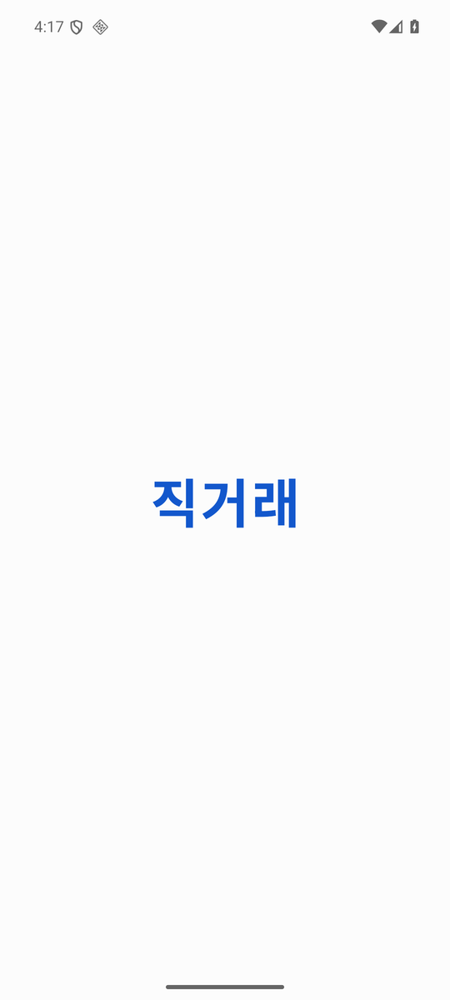
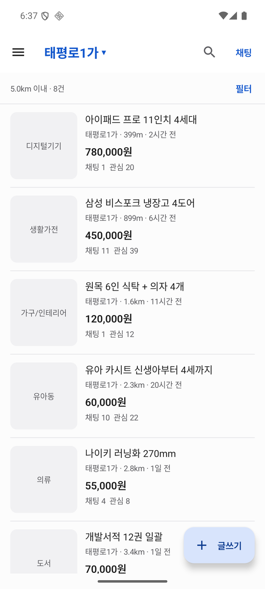
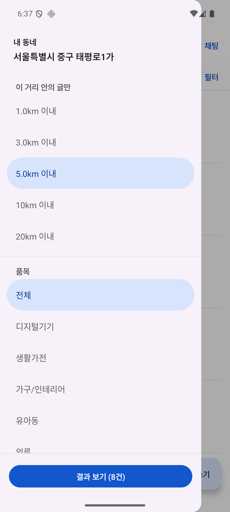
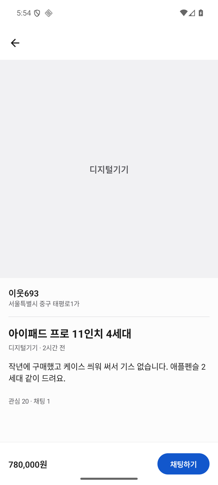
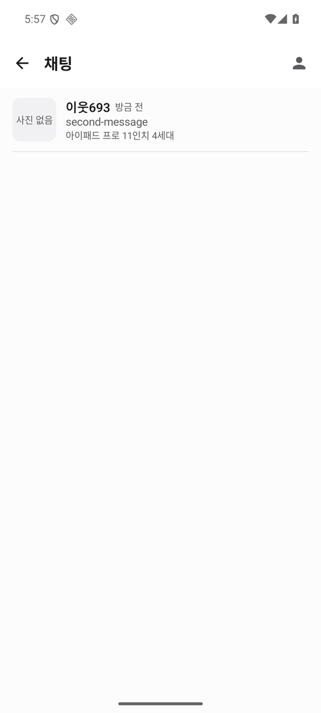
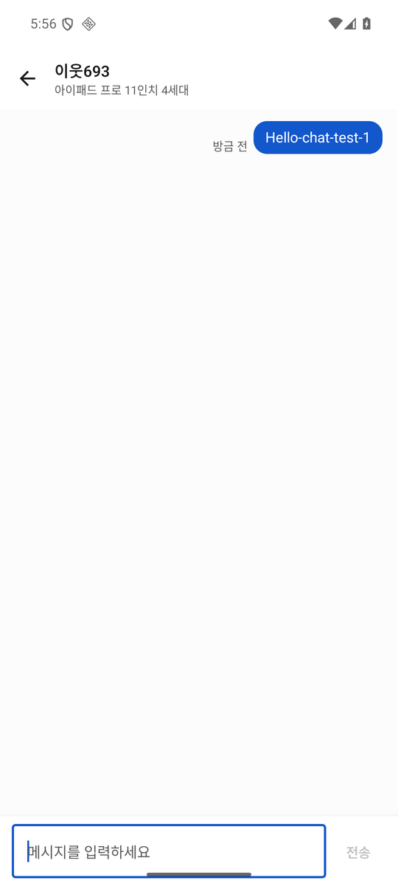

# 직거래 — 동네 기반 중고거래 앱 (설계 공개본)

GPS로 잡은 **동·읍·면** 을 기준으로, 정해진 거리 안의 물건 글만 보여 주는 안드로이드 중고거래 앱입니다.
이 저장소는 그 앱의 **도메인 계층과 설계 문서**를 공개한 것입니다.

| | | |
|:--:|:--:|:--:|
|  |  |  |
| 첫 화면 | 홈 — 가까운 순 목록 | 거리·품목 필터 |
|  |  |  |
| 상세 | 채팅 목록 | 1:1 채팅 |

---

## 이 저장소에 담긴 것

| | 내용 |
|---|---|
| ✅ `domain/` | 모델, 저장소 인터페이스, 거리·geohash 계산, UseCase, 테스트 |
| ✅ `docs/API_SPEC.md` | 서버가 맞춰야 할 REST 규격 (요청·응답 예시 포함) |
| ✅ `firebase/` | Firestore 보안 규칙, 알림 발송 함수, 요금 상한 브레이크 |
| ➖ 화면(Compose) · Room · Retrofit · Firebase 구현체 | 비공개 |

`domain` 은 안드로이드·DB·통신 라이브러리에 의존하지 않는 순수 Kotlin 모듈이라
그대로 clone 해서 빌드하고 테스트를 돌려 볼 수 있습니다.

```bash
./gradlew :domain:test
```

---

## 설계의 핵심 — 백엔드를 갈아끼울 수 있게

중고거래 앱을 여러 곳에 납품하다 보면 저장소가 매번 다릅니다.
그래서 **저장 방식이 바뀌어도 화면을 다시 만들지 않도록** 계약을 도메인에 두었습니다.

```kotlin
interface PostRepository {
    fun observeNearby(query: PostQuery): Flow<List<PostWithDistance>>
    suspend fun getById(id: String): Post?
    suspend fun create(post: Post): Result<Post>
    suspend fun delete(id: String): Result<Unit>
}
```

이 인터페이스만 만족하면 어떤 저장소든 붙습니다. 실제 앱에는 세 가지 구현이 있습니다.

- **Room** — 서버 없이 기기 안에서 동작 (검토·시연용)
- **REST** — 고객사 서버
- **Firebase** — 로그인·채팅·알림

무엇을 쓸지는 설정 한 줄(`backend=LOCAL | REST`)로 정해지고,
그 분기는 DI 모듈 한 파일에서만 일어납니다. 화면 코드는 어느 쪽인지 알지 못합니다.

의존 방향은 `app → domain ← data-*` 한 방향으로 고정되어 있고,
`domain` 이 Room·Retrofit 을 참조할 수 없도록 **빌드 설정에서 막아** 두었습니다.
급하게 작업하다 계층이 섞이면 컴파일 단계에서 걸립니다.

---

## "근처 글만 보이는" 기준

등록한 동네의 중심 좌표에서 사용자가 고른 거리(기본 5km) 안의 글만, 가까운 순으로 보여 줍니다.

거리 판정은 두 단계입니다.

1. **사각 범위로 1차 추림** — DB 인덱스를 쓸 수 있어 조회가 빠릅니다
2. **Haversine 거리로 확정** — 반경 밖을 잘라내고 가까운 순으로 정렬

서버가 위치 연산을 지원하지 않아도 성립하도록, 게시글에 **geohash** 를 함께 저장합니다.
`geoHash LIKE 'wydq%'` 같은 단순 prefix 질의만으로 근처 글을 넓게 받아 오고,
정확한 판정은 앱이 2단계에서 마무리합니다.

```kotlin
// 자르는 시점이 중요합니다. SQL 에서 LIMIT 을 걸면 사각 범위에는 들어오지만
// 반경 밖인 글이 자리를 차지해, 실제로는 10건이 안 되는 결과가 나옵니다.
posts.asSequence()
    .map { PostWithDistance(it, GeoMath.distanceKm(center, it.region.center)) }
    .filter { it.distanceKm <= query.radiusKm }
    .sortedBy { it.distanceKm }
    .take(query.limit)
```

관련 코드: [`GeoMath.kt`](domain/src/main/java/com/template/market/domain/geo/GeoMath.kt) ·
[`GeoHash.kt`](domain/src/main/java/com/template/market/domain/geo/GeoHash.kt) ·
[검증 테스트](domain/src/test/java/com/template/market/domain/geo/GeoTest.kt)

---

## 채팅은 왜 따로 다뤘나

게시글은 REST 5개로 어떤 서버든 붙지만, 채팅은 같은 방식으로 추상화되지 않습니다.

- **실시간이 필수** — 폴링으로 대체할 수 없습니다
- **로그인이 선행 조건** — 상대를 특정할 식별자가 없으면 성립하지 않습니다
- **알림 발송은 서버 몫** — 발송 권한을 앱에 넣으면 누구나 남에게 알림을 보낼 수 있습니다

그래서 발송은 [Cloud Functions](firebase/functions/index.js) 로 분리했고,
방 참여자만 읽고 쓸 수 있도록 [보안 규칙](firebase/firestore.rules) 을 따로 두었습니다.
메시지의 `senderId` 위조도 규칙에서 막습니다.

가입 화면으로 먼저 막지 않기 위해, 앱은 **가입 절차 없이 식별자만 먼저 발급**받고(익명 로그인)
사용자가 원할 때 Google 계정을 연결합니다. 연결해도 그동안의 대화는 그대로 이어집니다.

---

## 서버 연동

서버가 맞춰야 할 규격은 [`docs/API_SPEC.md`](docs/API_SPEC.md) 에 정리되어 있습니다.
엔드포인트 5개(목록·단건·등록·이미지 업로드·삭제)이고, 요청·응답 예시와 코드값까지 포함합니다.

**거리 계산은 서버가 하지 않아도 됩니다.** 넓게 돌려줘도 앱이 다시 걸러 냅니다.

---

## 만든 환경

Kotlin 2.3.21 · Gradle 9.7.1 · Jetpack Compose + Material 3 · Hilt · Room · Retrofit · Firebase
minSdk 26 / targetSdk 37

---

## 문의

앱 전체 소스와 납품 관련 문의는 따로 연락 주세요.
